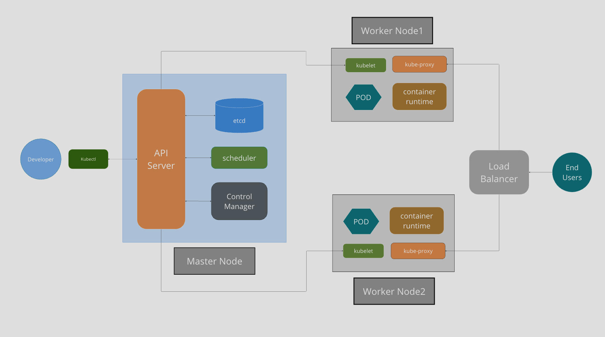

# Backend Tech Challenge

## A. Desenho da arquitetura

### i.Os requisitos do negocio (problema)

O processo de pedido de lanche se inicia quando um cliente se dirigi a um terminal de autoautendimento para fazer o pedido. O cliente chega no terminal e escolhe se irá fazer login no sistema com seu CPF ou se fará um pedido de forma anonima.

Depois disso o terminal apresenta ao cliente uma lista de lanches.

O cliente escolhe o lanche desejado. O terminal então apresenta a opção de acompanhamentos para o cliente.

O cliente escolhe se deseja acompanhamento no pedido.

A ultima escolha é referente a bebida. O cliente então fecha o carrinho de pedido.

Com os itens do pedido do cliente, o sistema gera uma ordem de pedido, calcula o total do mesmo e apresenta as informações referente aos itens e valor total para o cliente.

O cliente revisa as informações e ao confirmar, solicita a informação de pagamento. O sistema realiza a comunicação com o gateway de pagamento e apresenta um QR Code para que o pagamento seja realizado.

O cliente realiza o pagamento do pedido.

O Gateway confirma o pagamento para o sistema que por sua vez, altera o status do pedido para “Recebido” e envia o mesmo para a cozinha.

### ii: Os requisitos de infraestrutura.

A aplicação é desenvolvida em NodeJs com o framework Nest.js e como banco de dados utiliza MariaDB.

Não fizemos o deploy em ambiente de cloud. Para o ambiente de desenvolvimento, o MariaDB é executado em um pod do kubernetes.



## B. Collection das apis.

#### i. Collection do Postman (Json).

A colletion esta na raiz do projeto com o nome,
`COLLECTION DA API.postman_collection.json`,

## C. Guia completo para execução do projeto.

#### Instalação

Para começar a usar o projeto, siga os passos abaixo:

#### 1. Clone o repositório

Clone o projeto para o seu ambiente de desenvolvimento usando o comando git clone:

```bash
  git clone https://github.com/GRUPO-G68/backend-tech-challenge.git
```

#### 2. Entre no diretório do projeto

Navegue para o diretório recém-clonado usando o comando cd:

```bash
  cd backend-tech-challenge
```

#### 3. Instale as dependências

Use o gerenciador de pacotes Node.js (npm) para instalar todas as dependências do projeto:

```bash
  npm install
```

#### 4. Configure os arquivos de exemplo

Há arquivos/pastas de exemplo no projeto que você deve configurar para suas necessidades. Para fazer isso, siga estas etapas:

- Localize os arquivos/pastas com nomes terminando em `.exemple` e faça cópias deles sem a extensão `.exemple`. Por exemplo, `.env.exemple` deve ser renomeado para `.env`.

#### 5. Inicie o aplicativo com o Docker

Certifique-se de ter o Docker instalado em sua máquina e execute o seguinte comando para iniciar o aplicativo:

```bash
  docker compose up -d
```

Isso iniciará os contêineres Docker necessários para executar o projeto.

#### 6. Execute as migrations

Após o container iniciado por completo execute o seguinte comando para realizar as migrações do banco:

**Obs:** Certifique-se de que o container e o banco esteja de pé

```bash
  npm run migrate
```

#### 7. Execute os seeders

Após as migrations executadas, execute os seeders:

```bash
  npm run seed
```

#### 8. Importe a colletion da API

Agora você deve ter o aplicativo funcionando localmente em seu ambiente.

O arquivo da colletion esta na raiz do projeto e está nomeada de `COLLECTION DA API.postman_collection.json`,

#### 9. Acesse a documentação

Esse projeto utiliza a documentação dinâmica [swagger](https://swagger.io/docs/specification/adding-examples/) e [redocly](https://redocly.com/docs/), para acessar navegue a seguinte URL

redocly :

```bash
  localhost:9001/
```

swagger :

```bash
  localhost:30000/documentacao
```

#### 10. Acesso ao banco

```bash
  URL: localhoat
  user: root
  password: segredo
  port: 3306
```

### RODAR PROJETO LOCAL

//passo 1 - container
// docker run -e MYSQL_ROOT_PASSWORD=tech@123 -p 3306:3306 --name techchallenge -d mariadb
//passo 2 - cria o banco
//criar o banco no container techchallenge, banco-> tech_challenge
//passo 3 - roda a aplicação
//npm run start:dev

**Nota:** Certifique-se de ler a documentação completa do projeto.

## D. Link video demonstrativo.

#### link video youtube.
