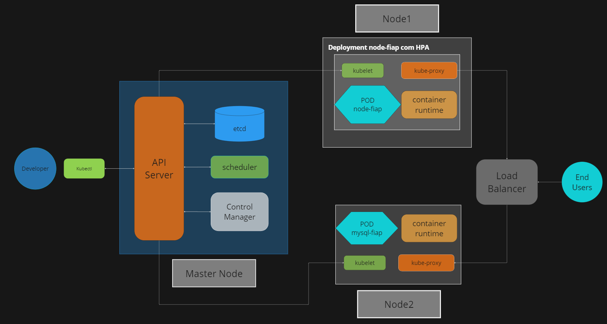

# Backend Tech Challenge

## A. Desenho da arquitetura

### i.Os requisitos do negocio (problema)

O processo de pedido de lanche se inicia quando um cliente se dirigi a um terminal de autoautendimento para fazer o pedido. O cliente chega no terminal e escolhe se irá fazer login no sistema com seu CPF ou se fará um pedido de forma anonima.

Depois disso o terminal apresenta ao cliente uma lista de lanches.

O cliente escolhe o lanche desejado. O terminal então apresenta a opção de acompanhamentos para o cliente.

O cliente escolhe se deseja acompanhamento no pedido.

A ultima escolha é referente a bebida. O cliente então fecha o carrinho de pedido.

Com os itens do pedido do cliente, o sistema gera uma ordem de pedido, calcula o total do mesmo e apresenta as informações referente aos itens e valor total para o cliente.

O cliente revisa as informações e ao confirmar, solicita a informação de pagamento. O sistema realiza a comunicação com o gateway de pagamento e apresenta um QR Code para que o pagamento seja realizado.

O cliente realiza o pagamento do pedido.

O Gateway confirma o pagamento para o sistema que por sua vez, altera o status do pedido para “Recebido” e envia o mesmo para a cozinha.

### ii: Diagrama da infraestrutura.


## B. Collection das apis.

A aplicação é desenvolvida em NodeJs com o framework Nest.js e como banco de dados utiliza MariaDB.

Não fizemos o deploy em ambiente de cloud. Para o ambiente de desenvolvimento, o MariaDB é executado em um pod do kubernetes para facilitar a execução local da solução.


#### i. Link do swagger.

Para acessar a documentação acesse:
http://localhost:30000/docs

Para subir a documentação, execute os passos listados em [Execute a soluçao com o kubernets](#execute-a-solução-com-o-kubernetes)

As chamadas no swagger já estão preenchidas com os modelos. Você pode alterar os valores ou enviar do jeito que estão. A aplicação será capaz de regristar a retornar os valores enviados nos endpoints de GET.

## C. Guia completo para execução do projeto.

### Instalação

Para começar a usar o projeto, siga os passos abaixo:

#### 1. Clone o repositório

Clone o projeto para o seu ambiente de desenvolvimento usando o comando git clone:

```bash
  git clone https://github.com/GRUPO-G68/backend-tech-challenge.git
```

#### 2. Entre no diretório do projeto

Navegue para o diretório recém-clonado usando o comando cd:

```bash
  cd backend-tech-challenge
```

#### 3. Desenvolvimento local

Baixe e instale o Node.js em https://nodejs.org/en/download.

Instale as dependencias do projeto com o comando

```bash
  npm install
```

Crie uma cópia do arquivo `.env.example` e altere o nome para `.env`. Dentro desse arquivo estão as variáveis referente a conexão com o banco de dados. Caso você for utilizar uma banco localmente ou com credenciais diferentes, atualiza as informações.

Você também precisa ter em execução o MariaDB na sua máquina para a aplicação funcionar, ou seguir os passos da seção abaixo para usar o banco de dados que é instanciado com o Kubernetes.

Após configurado, para executar o projeto localmente, execute o comando `npm run start:dev`.

A documentação da aplicação pode ser acessada no seu navegador através do endereço: http://localhost:9001/docs

### Execute a solução com o Kubernetes

Instale o Docker https://www.docker.com/products/docker-desktop/

> O projeto foi criado com a versão 4.26.1

Ative o Kubernets https://docs.docker.com/desktop/kubernetes/

> O projeto foi criado com a versão 1.28.2. Versões anteriores podem falhar em executar a solução com erros sobre unable to recognize .yaml: no matches for kind: ....

A imagem do banco de dados e da aplicação já constam nos arquivos .yaml para execução do projeto.

> IMPORTANTE: Para execução de imagem via Kubernetes com os arquivos .yaml, tenha certeza de definir o valor da variável `DB_HOST` para `svc-mysql-fiap`, caso contrário a aplicação não conseguirá se conectar ao pod com o banco dados.

Para executar usando a configuração atual, abra um terminal na raiz do projeto e execute o comando

```bash
kubectl apply -f ./src/infrastructure/k8s/
```

A aplicação leva alguns segundos para ficar disponível, dependo da configuração da maquina pode levar 1 ou 2 minutos. A documentação da aplicação pode ser acessada no seu navegador através do endereço: http://localhost:30000/docs

Para derrubar toda a soluçao, execute `kubectl delete namespace fiap`.

#### Editando a imagem

Caso você queira editar ou usar uma imagem diferente, faça as alterações no código, e no Dockerfile (caso necessário).

Faça o build da sua imagem:

```bash
docker build -t <nome:versão> .
```

Atualize a linha 18 do arquivo `node-fiap-deployment.yaml` com o nome da imagem que você deu no comando de build. Você não precisa fazer o upload para docker hub dessa imagem se não quiser, a configuração do projeto busca pela imagem localmente antes de tentar acessar a mesma no repositório online do Docker Hub.

### Guia de execução do Swagger

1. Cadastrar categoria
```JSON
{
  "name": "Lanches",
  "description": "É um lanche"
}
```
2. Cadastrar produto
```JSON
{
  "name": "Hamburguer com queijo",
  "price": 20,
  "categoryId": 1,
  "description": "Hamburguer com queijo, tipo, o nome diz tudo"
}
```
3. Cadastrar cliente
```JSON
{
  "name": "Ciclano",
  "document": "12312312",
  "email": "ciclano@coldmail.com"
}
```
4. Realizar pedido
```JSON
{
  "clientDocument": "12312312",
  "products": [
    {
      "productId": "Hamburguer com queijo",
      "quantity": 1
    }
  ]
}
```
5. Webhook Pagamento
```Json
{
  "id": "1",
  "topic": "payment"
}
```

## D. Link video demonstrativo.

#### link video youtube.
https://youtu.be/u0owNQ7n658
